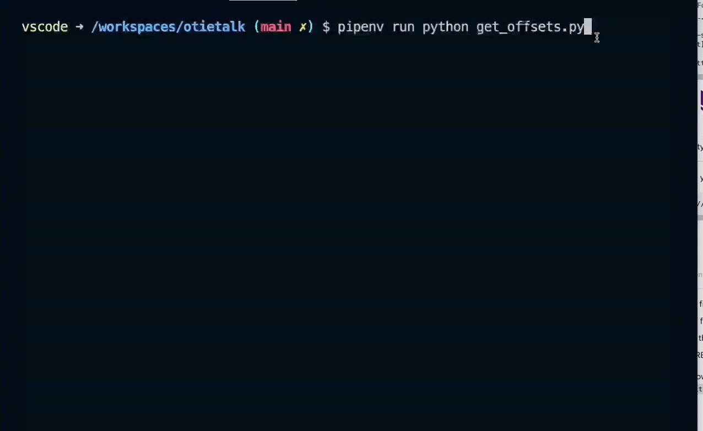

# Otietalk

> A collection of tools for interaction with OT2 and FLEX robots through the http API

## Install

### Local

- Make installed
- [Install uv](https://docs.astral.sh/uv/getting-started/installation/)
- Clone the repo.
  - `git clone https://github.com/Opentrons/otietalk.git`
- `make setup`

-----------------------------------------------------

## OT2 Tests we did on the heater shaker

## Heater Shaker Command Behavior Tests

### Setup

- Have a Heater Shaker attached to your robot and powered on.
- When the tests run responses from most of the API calls are logged into `responses.log`
  - It is good to delete this file from time to time as it appends.
- It is nice to be ssh into your robot and watching logs live
  - [Set up ssh](https://support.opentrons.com/s/article/Setting-up-SSH-access-to-your-OT-2)
  - On the robot run `journalctl -b -f`
- Run tests
  - There are two custom command line parameters
    - `--robot_ip`
      - example `--robot_ip 192.168.50.89`
    - `--robot_port`
    - example `--robot_port 31950`
  - run all tests `uv run pytest --robot_ip YOUR_ROBOT_IP --robot_port YOUR_ROBOT_PORT_IF_NOT_31950`
    - example `uv run pytest --robot_ip 192.168.50.89`
  - run one test by name
    - example `uv run pytest -k test_shake_happy_path --robot_ip 192.168.50.89`

## Heater Shaker commands

> From a terminal in the root directory of the repository

- Run
  - `uv run python hs_commands.py`
- Follow the prompts
- logs are in `responses.log`

## Heater Shaker Labware

> From a terminal in the root directory of the repository

- Run the wizard
  - `uv run python hs_labware.py`
- Follow the prompts

## Temperature Module V2 Labware

Labware that may be used:

- opentrons_96_aluminumblock_nest_wellplate_100ul
- opentrons_96_aluminumblock_biorad_wellplate_200ul
- opentrons_96_aluminumblock_generic_pcr_strip_200ul

> From a terminal in the root directory of the repository

- Run the wizard
  - `uv run python td_labware.py`
- Follow the prompts

## Get all offsets used in runs on a robot

> This tool retrieves the /runs data from a robot then constructs a list of the offset objects and outputs them to

- console
- file in JSON format (by default `offsets.json`)



> From a terminal in the root directory of the repository

- Run the wizard
  - `uv run python get_offsets.py`
- Follow the prompts

### Pretty print into a log file

go into the file `rich_it.py`
paste in your string to format in the variable `your_garbage`

```shell
uv run python rich_it.py
```

look in pretty.log for the output
