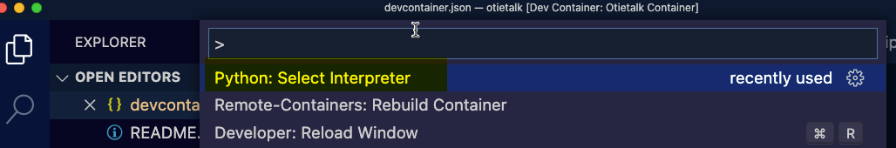
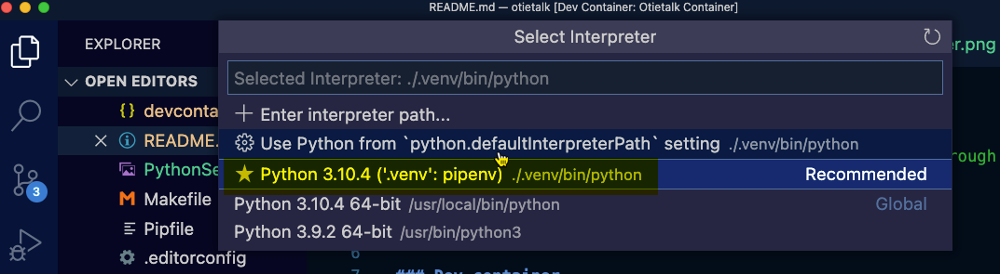

# Otietalk

> A collection of tools for interaction with the robot through the http API

## Install

### Dev container

- Have Docker installed.
- Clone the repo.
  - `git clone https://github.com/Opentrons/otietalk.git`
- Have VSCode open the dev container.
- Open VSCode command palette `command shift p`
- Select Python Interpreter 
  - Select the .venv in this directory. 
- Use the VSCode terminal not an external one.

### Local

- Have python 3.10.4 installed
- Have pipenv installed `pip install -U pipenv`
- Clone the repo.
  - `git clone https://github.com/Opentrons/otietalk.git`
- Install the pipenv managed dependencies from the root of the repo
  - `pipenv install -d`

## Heater Shaker Command Behavior Tests

### Setup

- Have a Heater Shaker attached to your robot and powered on.
- When the tests run responses from most of the API calls are logged into `responses.log`
  - It is good to delete this file from time to time as it appends.
- It is nice to be ssh into your robot and watching logs live
  - [Set up ssh](https://support.opentrons.com/s/article/Setting-up-SSH-access-to-your-OT-2)
  - On the robot run `journalctl -b -f`
- Run tests
  - There are two custom command line parameters
    - `--robot_ip`
      - example `--robot_ip 192.168.50.89`
    - `--robot_port`
    - example `--robot_port 31950`
  - run all tests `pipenv run pytest --robot_ip YOUR_ROBOT_IP --robot_port YOUR_ROBOT_PORT_IF_NOT_31950`
    - example `pipenv run pytest --robot_ip 192.168.50.89`
  - run one test by name
    - example `pipenv run pytest -k test_shake_happy_path --robot_ip 192.168.50.89`

## Heater Shaker commands

> From a terminal in the root directory of the repository

- Run
  - `pipenv run python hs_commands.py`
- Follow the prompts
- logs are in `responses.log`

## Heater Shaker Labware

> From a terminal in the root directory of the repository

- Run the wizard
  - `pipenv run python hs_labware.py`
- Follow the prompts

## Temperature Module V2 Labware

> From a terminal in the root directory of the repository

- Run the wizard
  - `pipenv run python td_labware.py`
- Follow the prompts

### Pretty print into a log file

go into the file `rich_it.py`
paste in your string to format in the variable `your_garbage`

```shell
pipenv run python rich_it.py
```

look in pretty.log for the output

### Other notes

> How to use pipenv to install direct `pipenv install -e git+https://github.com/kraanzu/textual_extras.git@main#egg=textual_extras`
